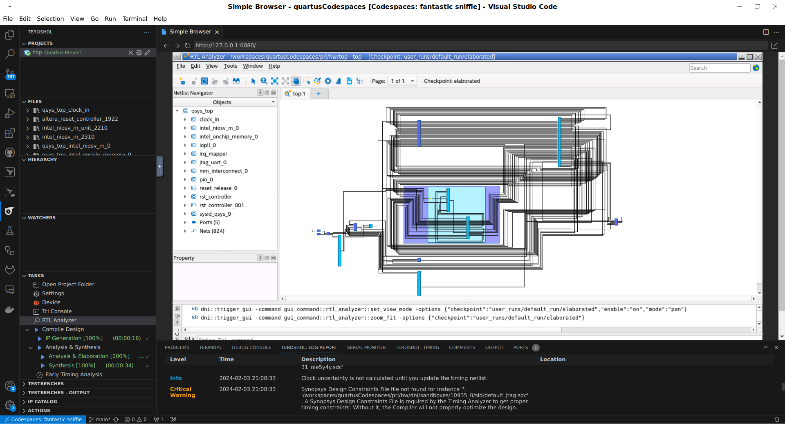
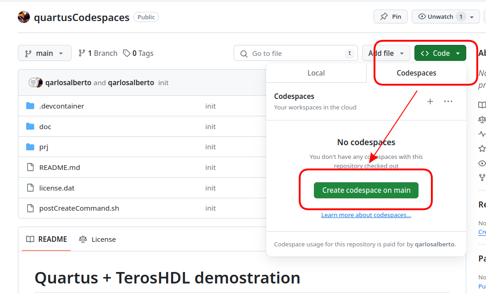
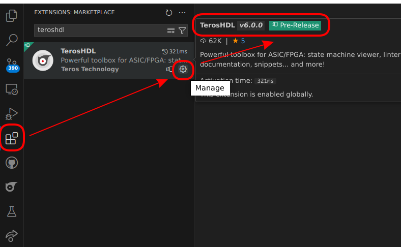
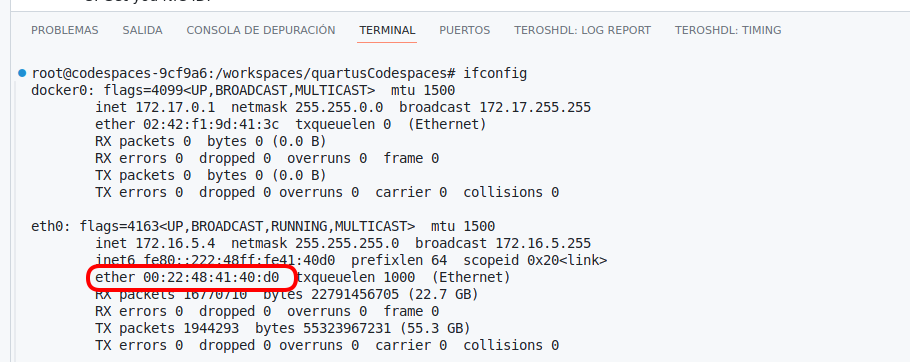
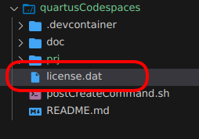
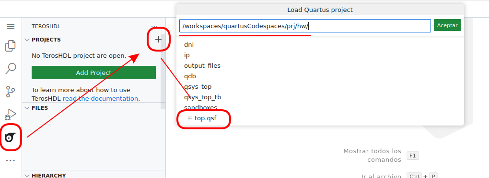
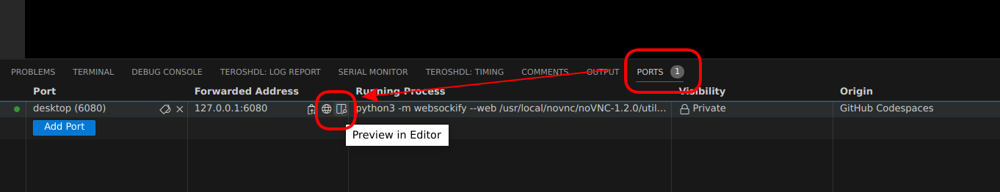

# Quartus + TerosHDL demostration

    

1. Create a Github Codespaces ***(Quartus Docker image has about 17 GB. The first time it will take a while to download it, be patient...)***

    

2. Make sure that you are using **TerosHDL 6.0.0**. TerosHDL minor than 6.0.0 doesn't support Quartus.

    

3. Get your NIC ID:

    

4. Create a Quartus Pro License with that NIC ID.
5. By default Quartus will use the environment variable: `LM_LICENSE_FILE=/workspaces/quartusDemo/license.dat`. So copy you license to `license.dat`:

    

6. Load the Nios project to TerosHDL: https://terostechnology.github.io/terosHDLdoc/docs/next/tool_manager/tools/quartus/project#loading-an-intel-quartus-project

    

7. If you want to open Quartus GUI (RTL Analyzer, IP configurator...). Go to `ports` panel and click in `Preview in Editor` (opens the GUI view in VSCode) or `Open in Browser` (opens the GUI in your browser):

    

8. Click in connect and type the pass: `vscode`

9. Enjoy Quartus in your browser :)

